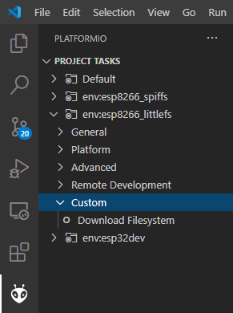

# ESP32 & ESP8266 Filesystem Downloader Plugin

## Description

This script provides an extension to the available PlatformIO targets / project tasks to download the filesystem (SPIFFS or LittleFS) from a running ESP32 / ESP8266  over the serial bootloader using esptool.py, and mklittlefs / mkspiffs for extracting.

See original topic at https://community.platformio.org/t/download-or-view-esp8266-file-system/17749. 

The lack of this feature in the core is also tracked in the issue https://github.com/platformio/platform-espressif8266/issues/238 (and related in the ESP32 platform).

## Limitations

* only works with ESP8266 and ESP32 chips. 
* only works over the serial bootloader too, downloading the flash content via a JTAG adapter and OpenOCD is not implemented.

## Usage

The extractor can be run by either using the VSCode task "Custom" -> "Download Filesystem".



Alternatively one can execute

```
pio run -t downloadfs
```
(with optional `-e <environment>`) from a [PIO commandline](https://docs.platformio.org/en/latest/integration/ide/vscode.html#platformio-core-cli). 

## Configuration
The output will be saved, by default, in the "unpacked_fs" of the project.
This folder can be changed by writing `custom_unpack_dir = some_other_dir` in the corresponding platformio.ini environment. 

The paramaters needed for extraction of the file system binary and further decoding are automatically deduced from the settings of the currently selected environment. That means that e.g. for the ESP8266, the settings `board_build.filesystem` and `board_build.ldscript` are respected as normal, and the filesystem type as well as start and end address of the filesystem in flash is extracted from it. For the ESP32, the partition table is also respected. This means that if you have a working project that writes some things to the filesystem, no further configuration of the script should be needed.

## Using in a different project

To add this extractor task functionality to your project, simply copy the `download_fs.py` of this repository to the root of your project (same as platformio.ini) and add 

```ini
extra_scripts = download_fs.py
```
to the `platformio.ini`. After a VSCode restart, the new task should appear.

## This Test Firmware

This repository contains a test firwmare for both ESP8266 and ESP32 chips and the LittleFS and SPIFFS filesystem flavors. The PlatformIO environments

* `esp8266_spiffs`: ESP8266 (NodeMCUv2) + SPIFFS
* `esp8266_littlefs`: ESP8266 (NodeMCUv2) + LittleFS
* `esp32dev`: ESP32 (ESP32 Dev Module C) + SPIFFS
* `esp32dev`: ESP32 (DOIT ESP32 DEVKIT V1) + LittleFS

are implemented. The `main.cpp` automatically recognizes which environment it is run in and interacts with the correct filesystem automatically.

The test firwmare programatically writes the file `hello.txt` in the filesystem with the content `Hello World!` and a suffix depending on the filesystem.

For testing of this script, please once upload the correct test firmware for your environment to the chip. 

## Example execution

As an example, an ESP8266 NodeMCUv2 board is connected to the PC. Commands are executed from the commandline.

In my case, to have a clean initial setup, I completely erase the flash once by manually doing 

```
python C:\Users\<user>\.platformio\packages\tool-esptoolpy\esptool.py erase_flash
```

Then, the test firmware for the ESP8266 + LittleFS combination is uploaded and monitored. 

```
pio run -e esp8266_littlefs -t upload -t monitor
```

(alternatively: Execute "Upload and Monitor" task in VSCode in correct environment)

The output at the bottom should say

```
Wrote 294720 bytes (216563 compressed) at 0x00000000 in 5.7 seconds (effective 415.2 kbit/s)...

[..]
================================ [SUCCESS] Took 15.89 seconds ================================
--- Available filters and text transformations: colorize, debug, default, direct, esp8266_exception_decoder, hexlify, log2file, nocontrol, printable, send_on_enter, time
--- More details at http://bit.ly/pio-monitor-filters
--- Miniterm on COM13  74880,8,N,1 ---
--- Quit: Ctrl+C | Menu: Ctrl+T | Help: Ctrl+T followed by Ctrl+H ---

 ets Jan  8 2013,rst cause:2, boot mode:(3,7)

load 0x4010f000, len 3584, room 16
tail 0
chksum 0xb0
csum 0xb0
v2843a5ac
~ld

Using LittleFS.
Writing file: /hello.txt
- file written
```

Press Ctrl+C to abort the monitor.

Let us now retrieve the file by doing 

```
pio run -e esp8266_littlefs -t downloadfs
```

(alternatively: execute "Custom" -> "Download Filesystem" in VSCode in correct environment)

Which should output

```
[...]
Entrypoint
Retrieving filesystem info for ESP8266.
FS_START: 0x300000
FS_END: 0x3fa000
FS_PAGE: 0x100
FS_BLOCK: 0x2000
Recognized LittleFS filesystem.
Parsed FS info: FS type FSType.LITTLEFS Start 0x300000 Len 1024000 Page size 256 Block size 8192 Tool: C:\Users\Max\.platformio\packages\tool-mklittlefs\mklittlefs
Executing flash download command.
"c:\users\max\appdata\local\programs\python\python38\python.exe" "C:\Users\Max\.platformio\packages\tool-esptoolpy@1.20800.0\esptool.py" --chip esp8266 --port "COM13" --baud 400000 --before default_reset --after hard_reset read_flash 0x300000 0xfa000 "C:\Users\Max\Documents\PlatformIO\Projects\esp32ftdi\downloaded_fs_0x300000_0xfa000.bin"
esptool.py v2.8
Serial port COM13
Connecting....
Chip is ESP8266EX
Features: WiFi
Crystal is 26MHz
MAC: 2c:3a:e8:06:17:b1
Uploading stub...
Running stub...
Stub running...
Changing baud rate to 400000
Changed.
1024000 (100 %)
1024000 (100 %)

Read 1024000 bytes at 0x300000 in 27.4 seconds (299.0 kbit/s)...
Hard resetting via RTS pin...
Downloaded filesystem binary.
Download was okay: True. File at: C:\Users\Max\Documents\PlatformIO\Projects\esp32ftdi\downloaded_fs_0x300000_0xfa000.bin
Executing extraction command: "C:\Users\Max\.platformio\packages\tool-mklittlefs\mklittlefs" -b 8192 -p 256 --unpack "unpacked_esp8266_littlefs" "C:\Users\Max\Documents\PlatformIO\Projects\esp32ftdi\downloaded_fs_0x300000_0xfa000.bin"
hello.txt        > ./unpacked_esp8266_littlefs/hello.txt        size: 27 Bytes
Unpacked filesystem.
Extracted 1 file(s) from filesystem.
```

The file `unpacked_esp8266_littlefs/hello.txt` was recovered and saved in the project folder. 

The content of the file is 

```text
> type .\unpacked_esp8266_littlefs\hello.txt
Hello from ESP8266 LittleFS
```

Just as the firmware has written it (see `main.cpp`).
